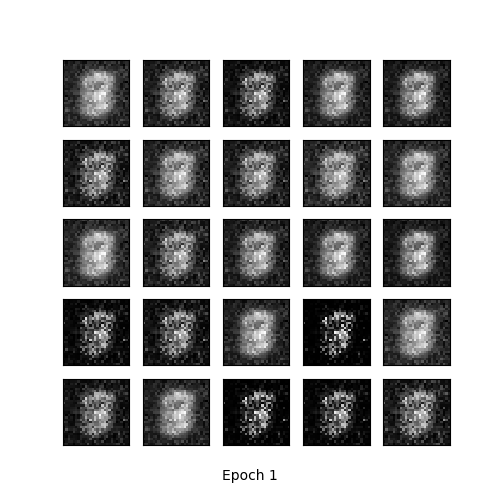
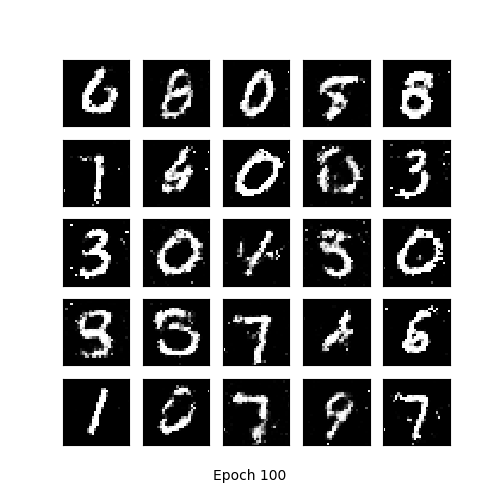
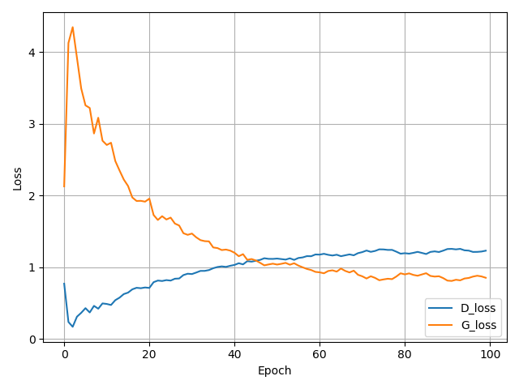

# Generative Adversarial Network

Run by: python gan_tensorflow.py  to train this simple implementation of GAN

## GAN for handwriting numbers using tensorflow and MNIST training dataset

### 1st epoch 

### 100th epoch 

### Loss Graph

